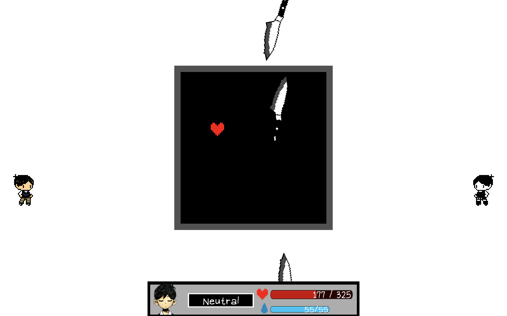

# Omori Final Battle Deltarune Style

  

Download the game [here](https://gamejolt.com/games/omori-deltarune-fangame/828734).

Video demonstration [here](https://youtu.be/LG3_nP22R3k).

This game creates the final battle in Omori (a game by OMOCAT) into a Deltarune (a game by Toby Fox) style battle. It is based off an animation by Mehmet SK on YouTube, a link to their video can be found [here](https://youtu.be/4FVz1QNqFq4).

This game was created using Unity, and GIMP to create the visuals.

Omori is one of my favourite games of all time, and Toby Fox is the one that inspired me to start programming/game development, and also inspired me to start my favourite hobbies of playing instruments and creating music, so when I saw Mehmet's animation on YouTube, I knew I had to make it into a playable game. 
Thank you Mehmet for making an amazing animation, and thank you Toby Fox and OMOCAT for making amazing games.
